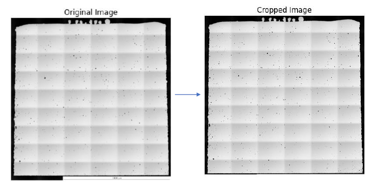
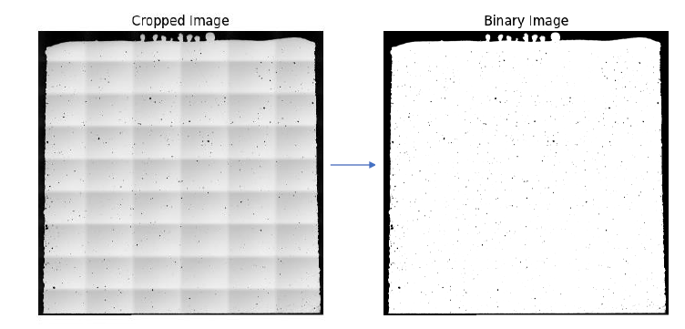
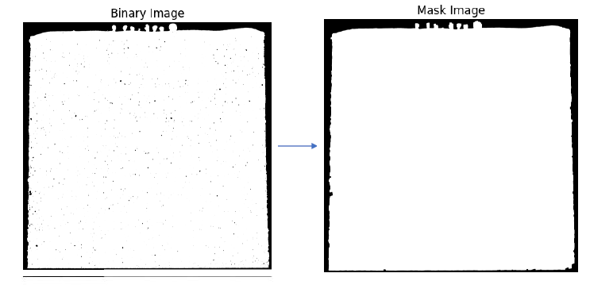
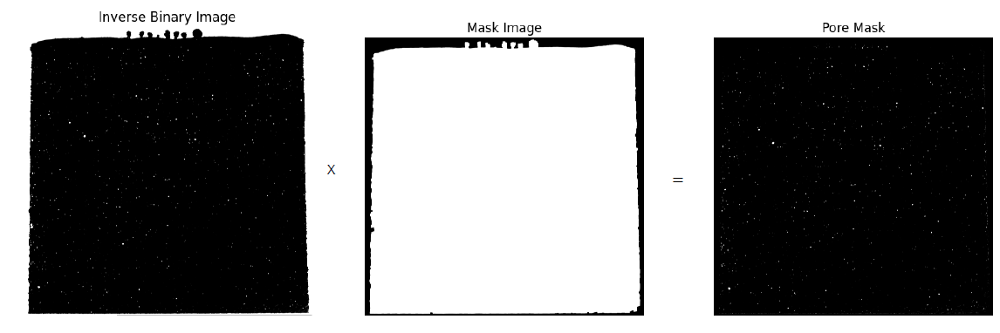

# Porosity and Grain Analysis Algorithm

This application analyzes microscopy images to determine material porosity and grain size. The algorithm relies on automated thresholding, morphological operations, and the statistical line intercept method to process the samples. Below is a detailed breakdown of the algorithm's steps, with a special focus on the **Advanced Settings** that control its behavior.

---

## 1. Image Preparation and Legend Removal

To prevent text or scale markers from being misclassified as pores or sample material, the algorithm first removes the legend at the bottom of the image.

- **Cropping Logic:** The image is cropped if the given crop ratio is given, to black out the legend.



## 2. Finding the Sample (Area Mask)



The algorithm isolates the sample from the background by creating an Area of Interest mask. This is where the core **Threshold** and **Morphology** advanced parameters come into play.

### Advanced Threshold Setting

- **Mask Threshold (0 = Auto):** This controls the initial binarization to find the outer boundary of the sample. Setting this to **0** uses Otsu's method to automatically find the optimal cutoff. A manual value (1-255) forces a specific brightness cutoff.

### Advanced Morphology Setting



After binarization, morphological operations clean up the mask. These settings directly override the basic "Pore Size" presets.

- **Open Kernel Ratio (0-5):** Controls the removal of small noise specks from the sample boundary. Higher values remove larger specks but can erode real details (ranges from 1/400 to 1/10 of the processing height).

- **Open Iterations:** Sets how many times the noise-removal (Open) step repeats. A value of 0 disables it; higher values yield more aggressive cleanup.

- **Close Kernel Ratio (0-5):** Determines how large a dark region can be before it is filled in and counted as part of the solid sample mask. Higher values tolerate bigger dark regions.

- **Close Iterations:** Sets how many times the hole-filling (Close) step repeats. A value of 0 disables it; higher values yield more aggressive filling.

- **Shrink Mask (0-5):** An optional setting applied at the very end to pull the final boundary inward. This prevents the mask from hugging rough outer edges or polishing artifacts.

```text
function select_area_of_interest(image, mask_threshold, morphology, shrink_ratio):
    binary_img = apply_threshold(image, mask_threshold)

    // Advanced Morphology cleanup
    mask = morphology_open(binary_img, morphology.open_kernel, morphology.open_iters)
    mask = morphology_close(mask, morphology.close_kernel, morphology.close_iters)

    // Exclude outer edge artifacts
    if shrink_ratio > 0:
        mask = erode(mask, shrink_ratio)

    return mask

```

---

## 3. Porosity Calculation



Porosity is the percentage of valid pore area relative to the total material area. The algorithm inverts the binary image to highlight potential pores and strictly filters them using the Area Mask.

### Advanced Threshold Setting

- **Threshold (0 = Auto):** This determines the brightness cutoff specifically for separating pores from solid material inside the sample. A value of **0** uses automatic Otsu thresholding; otherwise, a manual value (1-255) is applied.
  Do not confuse this with the mask threshold, they are two different values used in different stages. The brightness contrast between the sample and the background is often completely different from the contrast between the solid material and a microscopic pore. For example, if the background is very dark, a single global threshold might perfectly outline the sample but accidentally classify light-gray shadows inside the sample as pores. By separating them, you can dial in the Mask Threshold to perfectly outline the sample's perimeter, and then independently tune the Threshold to capture only the true pores inside the material.

### Advanced Border Setting

The application calculates both Full Image Porosity and Border Porosity. The border porosity is restricted to a thin ring near the edge of the mask, controlled by these settings:

- **Border Width (px):** A fixed thickness in pixels for the border ring. If set greater than 0, it overrides the ratio setting.

- **Border Ratio Level (0-3):** Used only if Border Width is 0. It sets the border thickness as a percentage (5%, 10%, 15%, or 20%) of the sample's estimated radius.

```text
function calculate_porosity(image, mask, threshold, border_settings):
    binary_img = apply_threshold(image, threshold)
    whole_area = count_white_pixels(mask)

    // Find pores strictly inside the sample area
    inverse_binary = bitwise_not(binary_img)
    actual_pores = bitwise_and(inverse_binary, mask)

    // Full Porosity
    pore_area = count_white_pixels(actual_pores)
    full_porosity = (pore_area * 100) / whole_area

    // Border Porosity
    border_mask = generate_border(mask, border_settings.width, border_settings.ratio)
    border_pores = bitwise_and(inverse_binary, border_mask)
    border_porosity = (count_white_pixels(border_pores) * 100) / count_white_pixels(border_mask)

    return full_porosity, border_porosity

```

---

## 4. Grain Size Calculation (Etched Samples Only)

[Insert Image Here: Example of the grain boundary overlay with grid lines]

For etched samples, grain size is calculated using the statistical Line Intercept Method.

- **Edge Detection:** Canny edge detection identifies grain boundaries, restricted strictly to the Area Mask.

- **Grid Lines:** Horizontal and vertical test lines are drawn across the image. The user defines the number of lines; more lines yield better sampling but take longer.

- **Calculation:** The algorithm counts the boundary intersections along the grid lines. The mean intercept length (pixels) is divided by the intersections and converted to micrometers (µm) using the detected **Zoom Factor**.

```text
function calculate_grain_size(image, mask, num_lines, zoom_factor):
    edges = canny_edge_detection(image)
    valid_edges = bitwise_and(edges, mask)

    total_line_length = 0
    total_intersections = 0

    // Process test lines
    for line in generate_grid_lines(num_lines):
        total_line_length += count_pixels(line, mask)
        total_intersections += count_edge_crossings(line, valid_edges)

    mean_intercept_px = total_line_length / total_intersections
    grain_size_um = mean_intercept_px * (zoom_factor / image_width)

    return grain_size_um

```

---

## 5. Performance Options: Fast vs. Accurate

To manage processing times on high-resolution microscopy images, the application offers execution speed controls.

- **Fast Mask Processing:** When enabled, the image is downsized before the algorithm attempts to detect the sample boundary. This drastically speeds up the morphological cleanup step.

- **Processing Size (px):** Determines the maximum pixel dimension of the longest side during Fast Mask Processing. Higher values (e.g., 1024) provide more precise boundaries but compute slower than lower values (e.g., 512). Turning Fast Mask off runs the operations at the original, full resolution.
